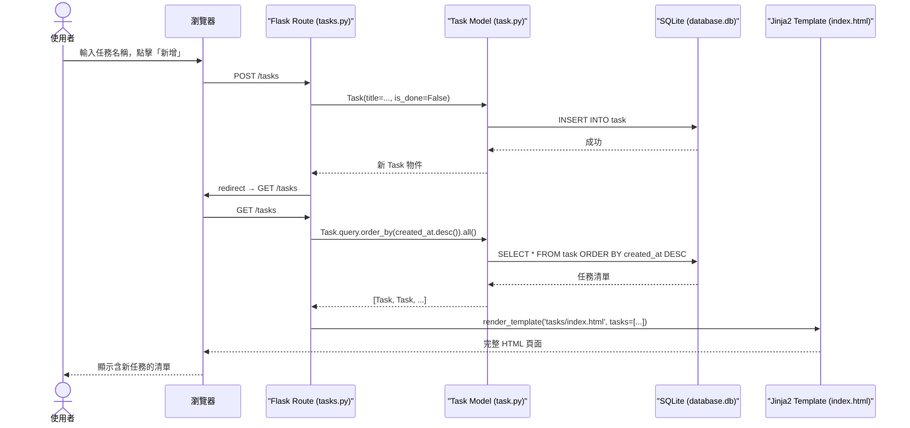

# 系統架構文件（Architecture）

**專案名稱：** 個人任務管理系統  
**文件版本：** v1.0  
**撰寫日期：** 2026-04-13  
**依據文件：** [docs/PRD.md](./PRD.md)

---

## 1. 技術架構說明

### 1.1 選用技術與原因

| 技術 | 版本建議 | 選用原因 |
|------|----------|----------|
| **Python** | 3.10+ | 語法清晰、生態豐富，適合初學者快速上手 |
| **Flask** | 3.x | 輕量級 Web 框架，零設定即可啟動，適合 MVP 快速開發 |
| **Jinja2** | 隨 Flask 附帶 | Flask 內建模板引擎，可直接在 HTML 中渲染後端資料 |
| **SQLAlchemy** | 2.x | ORM 工具，用物件操作資料庫，自動防止 SQL Injection |
| **SQLite** | 隨 Python 附帶 | 無需安裝伺服器，資料存成單一 `.db` 檔，開發與部署都方便 |
| **Vanilla CSS** | — | 無額外依賴，搭配 RWD 媒體查詢即可完成響應式設計 |
| **JavaScript（少量）** | — | 僅用於前端篩選切換，不做複雜互動 |

### 1.2 Flask MVC 模式說明

本系統採用 **MVC（Model / View / Controller）** 架構模式：

```
┌─────────────┬──────────────────────────────────────────────────────────┐
│    層級      │  職責說明                                                 │
├─────────────┼──────────────────────────────────────────────────────────┤
│  Model      │  定義資料結構（Task 資料表）、處理資料庫的 CRUD 操作         │
│  （模型層）  │  位置：app/models/task.py                                  │
├─────────────┼──────────────────────────────────────────────────────────┤
│  View       │  Jinja2 HTML 模板，負責將資料呈現給使用者，不含業務邏輯      │
│  （視圖層）  │  位置：app/templates/                                      │
├─────────────┼──────────────────────────────────────────────────────────┤
│  Controller │  Flask 路由函式，接收 HTTP Request、呼叫 Model、回傳 View   │
│  （控制層）  │  位置：app/routes/tasks.py                                 │
└─────────────┴──────────────────────────────────────────────────────────┘
```

---

## 2. 專案資料夾結構

```
web_app_development/          ← 專案根目錄
│
├── app/                      ← Flask 應用程式主體
│   ├── __init__.py           ← 建立 Flask app、初始化 SQLAlchemy、註冊 Blueprint
│   │
│   ├── models/               ← 資料庫模型（Model 層）
│   │   ├── __init__.py
│   │   └── task.py           ← Task 資料表（id, title, is_done, created_at）
│   │
│   ├── routes/               ← 路由處理（Controller 層）
│   │   ├── __init__.py
│   │   └── tasks.py          ← 任務相關路由（新增、完成、刪除、列表）
│   │
│   ├── templates/            ← Jinja2 HTML 模板（View 層）
│   │   ├── base.html         ← 基底模板（導覽列、共用 CSS/JS 引入）
│   │   └── tasks/
│   │       └── index.html    ← 任務清單主頁（含新增表單與任務列表）
│   │
│   └── static/               ← 靜態資源
│       ├── css/
│       │   └── style.css     ← 全站樣式（含 RWD 響應式設計）
│       └── js/
│           └── filter.js     ← 前端篩選功能（全部 / 待完成 / 已完成切換）
│
├── instance/                 ← Flask instance 資料夾（不納入版本控制）
│   └── database.db           ← SQLite 資料庫檔案
│
├── docs/                     ← 專案文件
│   ├── PRD.md                ← 產品需求文件（已完成）
│   ├── ARCHITECTURE.md       ← 本文件
│   ├── DB_Schema.md          ← 資料庫設計（待產出）
│   └── API_Design.md         ← 路由與 API 設計（待產出）
│
├── app.py                    ← 應用程式入口（flask run 起點）
├── requirements.txt          ← Python 套件清單
├── .gitignore                ← 排除 instance/、__pycache__/ 等
└── README.md                 ← 專案說明
```

---

## 3. 元件關係圖

### 3.1 整體資料流（以「新增任務」為例）



### 3.2 元件依賴關係

```
app.py
  └── app/__init__.py
        ├── Flask()              ← 建立應用程式
        ├── SQLAlchemy(app)      ← 連接資料庫
        └── Blueprint 註冊
              └── app/routes/tasks.py        (Controller)
                    ├── 依賴 app/models/task.py  (Model)
                    └── 渲染 app/templates/tasks/ (View)
                              └── 繼承 base.html
                                    ├── 引用 static/css/style.css
                                    └── 引用 static/js/filter.js
```

---

## 4. 關鍵設計決策

### 決策 1：使用 Flask Blueprint 組織路由

**決定：** 將任務相關路由封裝在 `app/routes/tasks.py` 並以 Blueprint 方式掛載。

**原因：**
- 避免所有路由都堆在 `app.py`，未來新增功能（如使用者登入）不會造成混亂
- Blueprint 支援 URL prefix（如 `/tasks`），路由命名更清晰

---

### 決策 2：使用 SQLAlchemy ORM 而非 sqlite3

**決定：** 使用 `Flask-SQLAlchemy` 操作資料庫，而非直接使用 Python 內建的 `sqlite3`。

**原因：**
- ORM 自動處理參數化查詢，防止 SQL Injection
- 用 Python 物件操作資料，程式碼更易讀
- 未來若要換成 PostgreSQL，只需更改連線字串，不需重寫 SQL

---

### 決策 3：使用 Jinja2 模板繼承（Template Inheritance）

**決定：** 建立 `base.html` 基底模板，其他頁面繼承它（``）。

**原因：**
- 導覽列、CSS 引入、`<head>` 區塊只需寫一次
- 各頁面只需實作 `` 部分，維護成本低

---

### 決策 4：前端 JavaScript 處理篩選（F05）

**決定：** 依完成狀態篩選由前端 `filter.js` 以 CSS class 切換實作，不發新 HTTP Request。

**原因：**
- 任務數量少（個人使用），所有資料一次載入即可
- 前端切換即時反應，使用體驗更流暢（無頁面閃爍）
- 減少後端路由複雜度

---

### 決策 5：SQLite 資料庫放在 `instance/` 資料夾

**決定：** Flask 的 `instance_path` 預設指向 `instance/`，資料庫檔案放置此處並加入 `.gitignore`。

**原因：**
- `instance/` 是 Flask 官方慣例，存放環境相關設定與資料
- 避免資料庫檔案被 commit 進版本控制，防止個資外洩
- 部署到不同環境時，只需建立新的 `database.db`，不影響程式碼

---

## 5. 技術堆疊總覽

```
┌────────────────────────────────────────────────┐
│          使用者瀏覽器 (Browser)                  │
│  HTML + CSS (style.css) + JS (filter.js)        │
└────────────────────┬───────────────────────────┘
                     │ HTTP Request / Response
┌────────────────────▼───────────────────────────┐
│            Flask Web Server                     │
│  ┌──────────────────────────────────────────┐  │
│  │  Controller（routes/tasks.py）           │  │
│  ├──────────────────────────────────────────┤  │
│  │  Model（models/task.py）                 │  │
│  │  ↕ SQLAlchemy ORM                        │  │
│  ├──────────────────────────────────────────┤  │
│  │  View（templates/tasks/index.html）      │  │
│  │  Jinja2 渲染 HTML                        │  │
│  └──────────────────────────────────────────┘  │
└────────────────────┬───────────────────────────┘
                     │ ORM Query
┌────────────────────▼───────────────────────────┐
│      SQLite（instance/database.db）             │
│      資料表：task                               │
└────────────────────────────────────────────────┘
```

---

## 相關文件

- [PRD.md](./PRD.md) — 產品需求文件（已完成）
- [DB_Schema.md](./DB_Schema.md) — 資料庫設計（待產出）
- [API_Design.md](./API_Design.md) — 路由與 API 設計（待產出）
