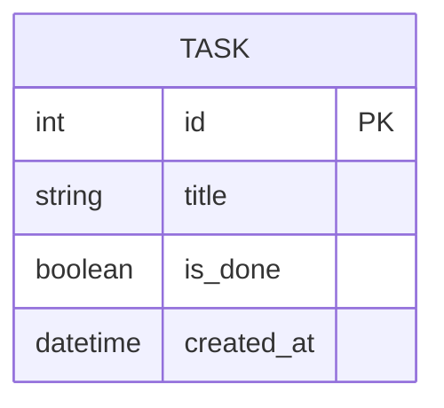

# 資料庫設計文件（DB Design）

**專案名稱：** 個人任務管理系統  
**文件版本：** v1.0  
**撰寫日期：** 2026-04-21  
**依據文件：** [PRD.md](./PRD.md)｜[ARCHITECTURE.md](./ARCHITECTURE.md)｜[FLOWCHART.md](./FLOWCHART.md)

---

## 1. ER 圖（實體關係圖）

本系統 MVP 階段僅有一張核心資料表：`task`。



> 💡 本版本為單人個人使用系統，無需多使用者帳號設計。若未來擴充登入功能，可新增 `user` 資料表並以 `user_id` FK 關聯至 `task`。

---

## 2. 資料表詳細說明

### 2.1 `task` 資料表

儲存所有使用者建立的任務（待辦事項）。

| 欄位名稱 | 型別 | 必填 | 預設值 | 說明 |
|----------|------|------|--------|------|
| `id` | `INTEGER` | ✅ | AUTOINCREMENT | 主鍵，唯一識別每筆任務 |
| `title` | `VARCHAR(200)` | ✅ | — | 任務名稱，不可為空 |
| `is_done` | `BOOLEAN` | ✅ | `False` | 任務完成狀態：`False` = 未完成，`True` = 已完成 |
| `created_at` | `DATETIME` | ✅ | `NOW()` | 任務建立時間，用於清單排序（最新優先） |

#### 主鍵與索引

- **Primary Key**：`id`（INTEGER PRIMARY KEY AUTOINCREMENT）
- **建議索引**：`created_at DESC`（清單以建立時間降冪排序，可加速查詢）

#### 欄位限制說明

- `title`：最長 200 字元，不允許空字串（由應用層驗證）
- `is_done`：SQLite 以 `0`（False）/ `1`（True）儲存布林值
- `created_at`：由 SQLAlchemy 在記錄建立時自動填入（`datetime.utcnow`）

---

## 3. SQL 建表語法

完整 SQLite 建表語法已儲存於 [`database/schema.sql`](../database/schema.sql)。

```sql
-- 個人任務管理系統 - SQLite Schema
-- 版本：v1.0 | 日期：2026-04-21

CREATE TABLE IF NOT EXISTS task (
    id         INTEGER      PRIMARY KEY AUTOINCREMENT,
    title      VARCHAR(200) NOT NULL,
    is_done    BOOLEAN      NOT NULL DEFAULT 0,
    created_at DATETIME     NOT NULL DEFAULT (datetime('now'))
);

-- 加速依建立時間排序的查詢
CREATE INDEX IF NOT EXISTS idx_task_created_at ON task (created_at DESC);
```

---

## 4. Python Model 說明

Model 程式碼使用 **Flask-SQLAlchemy 2.x** 實作，位於 `app/models/task.py`。

### 設計原則

- 使用 SQLAlchemy ORM，透過物件操作資料庫，防止 SQL Injection
- 提供完整 CRUD 靜態方法，讓 Route 層不需直接接觸 `db.session`
- `created_at` 使用 `datetime.utcnow` 自動填入，確保一致性

### 提供的 CRUD 方法

| 方法 | 說明 |
|------|------|
| `Task.create(title)` | 建立新任務，回傳 Task 物件 |
| `Task.get_all()` | 取得所有任務（依建立時間降冪排序） |
| `Task.get_by_id(id)` | 依 id 取得單筆任務，不存在則回傳 404 |
| `Task.toggle(id)` | 切換任務的完成狀態（True ↔ False） |
| `Task.delete(id)` | 刪除指定任務 |

詳細程式碼請見：[`app/models/task.py`](../app/models/task.py)

---

## 相關文件

- [PRD.md](./PRD.md) — 產品需求文件（已完成）
- [ARCHITECTURE.md](./ARCHITECTURE.md) — 系統架構設計（已完成）
- [FLOWCHART.md](./FLOWCHART.md) — 流程圖（已完成）
- [API_Design.md](./API_Design.md) — 路由與 API 設計（待產出）
