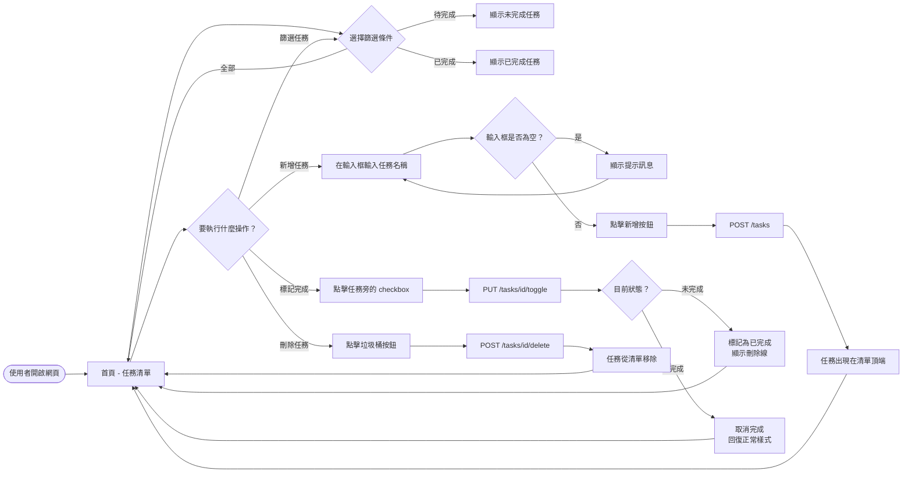
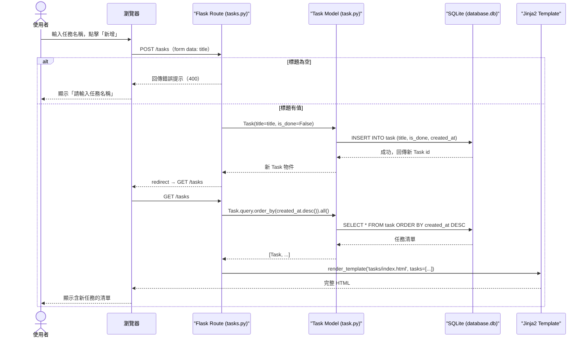
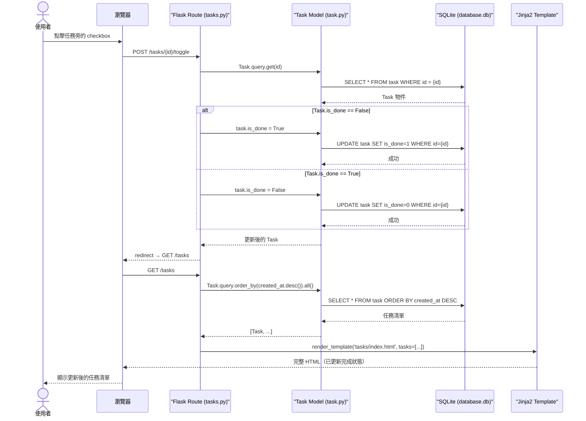
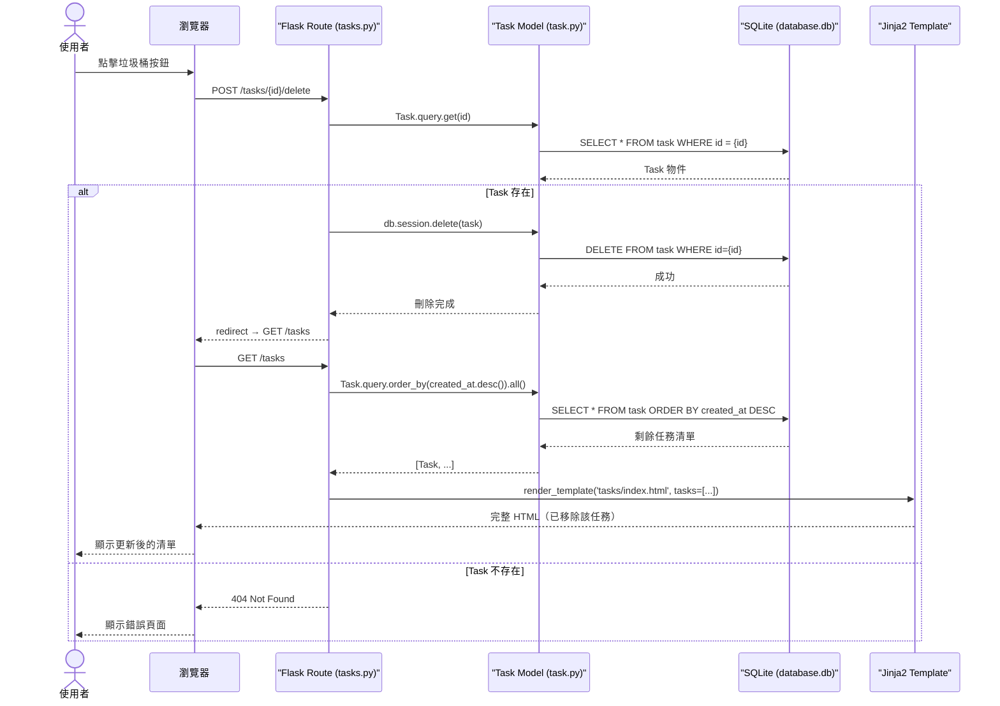
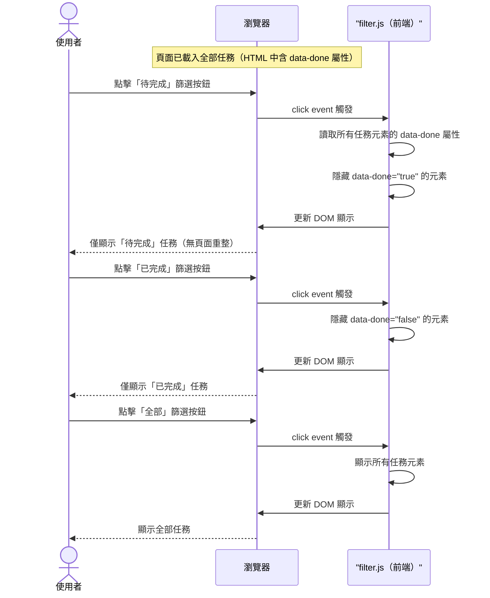

# 流程圖文件（Flowchart）

**專案名稱：** 個人任務管理系統  
**文件版本：** v1.0  
**撰寫日期：** 2026-04-13  
**依據文件：** [PRD.md](./PRD.md)｜[ARCHITECTURE.md](./ARCHITECTURE.md)

---

## 1. 使用者流程圖（User Flow）

描述使用者從開啟網頁到完成各項操作的完整路徑。

---

## 2. 系統序列圖（System Sequence Diagram）

以下為各主要功能的後端資料流，描述「使用者操作」到「資料庫變更」的完整過程。

### 2.1 新增任務（F01）

---

### 2.2 標記任務完成 / 取消完成（F02）

---

### 2.3 刪除任務（F03）

---

### 2.4 依狀態篩選任務（F05）

> 篩選功能由前端 JavaScript 處理，無需後端請求。

---

## 3. 功能清單對照表

| 功能 ID | 功能名稱 | URL 路徑 | HTTP 方法 | 說明 |
|---------|----------|----------|-----------|------|
| F01 | 新增任務 | `/tasks` | `POST` | 接收表單資料，建立新 Task 並存入 DB |
| F02 | 標記完成 / 取消 | `/tasks/<id>/toggle` | `POST` | 切換指定任務的 `is_done` 狀態 |
| F03 | 刪除任務 | `/tasks/<id>/delete` | `POST` | 從 DB 刪除指定任務 |
| F04 | 顯示任務清單 | `/tasks` | `GET` | 查詢所有任務，渲染 index.html |
| F05 | 依狀態篩選 | —（前端處理） | —（JS） | filter.js 切換 DOM 顯示，無需路由 |

> 💡 HTML Form 只支援 GET / POST，因此使用 `POST` 代替 `DELETE` / `PATCH`。

---

## 相關文件

- [PRD.md](./PRD.md) — 產品需求文件（已完成）
- [ARCHITECTURE.md](./ARCHITECTURE.md) — 系統架構設計（已完成）
- [DB_Schema.md](./DB_Schema.md) — 資料庫設計（待產出）
- [API_Design.md](./API_Design.md) — 路由與 API 設計（待產出）
